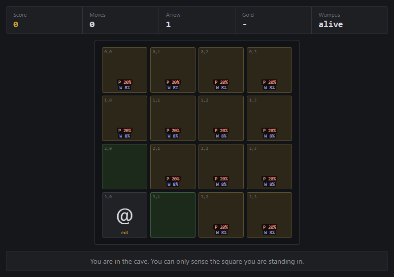
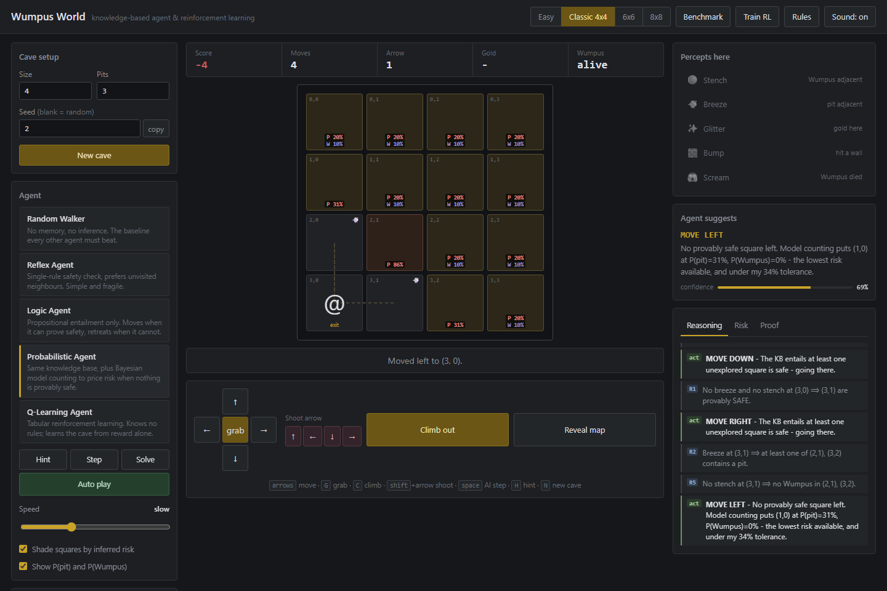
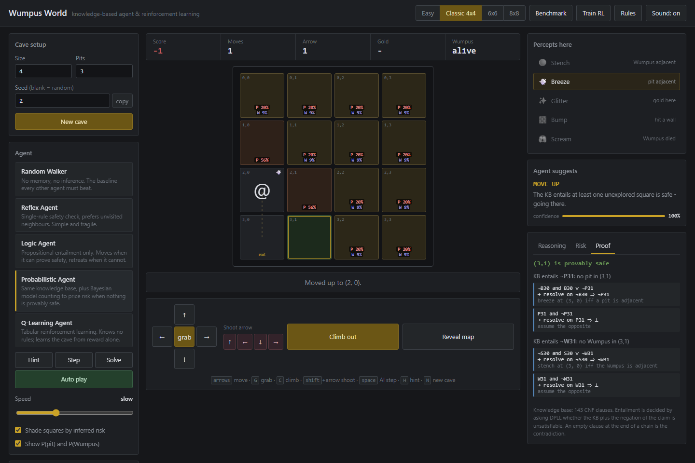
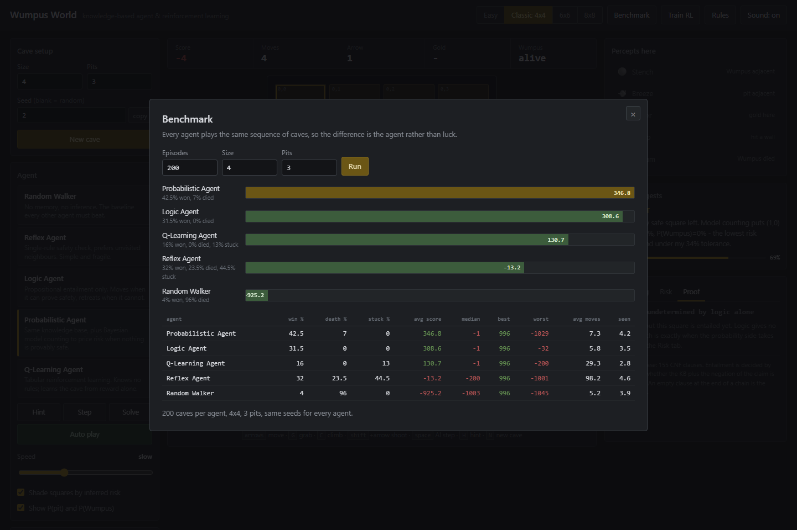
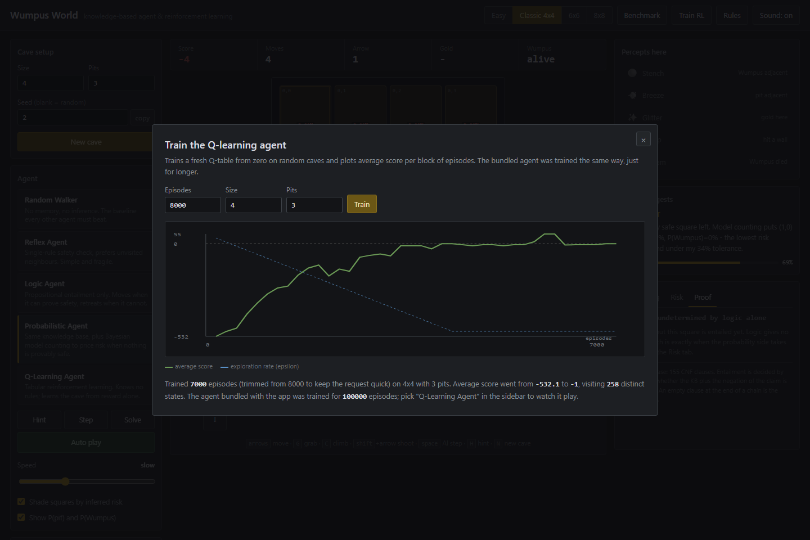
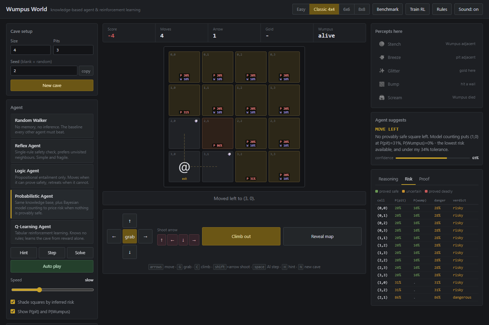
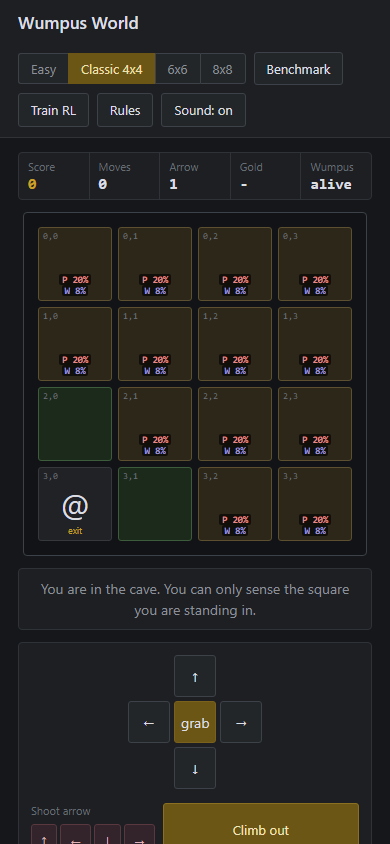
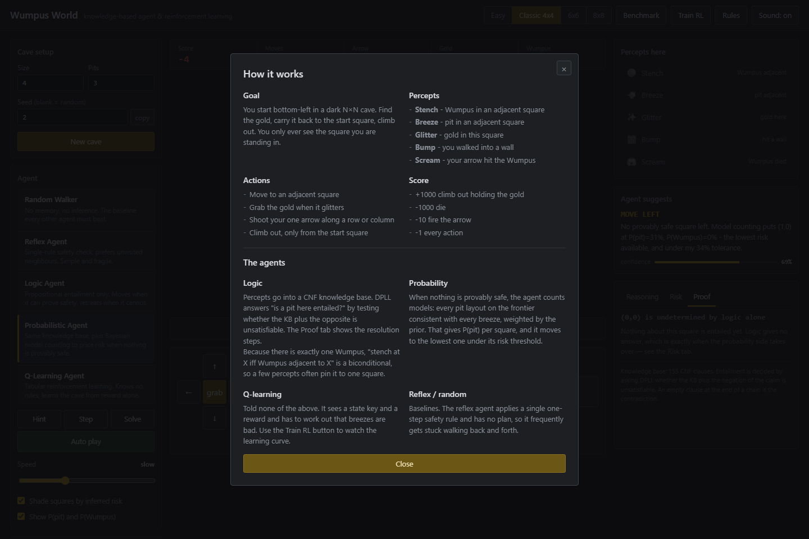
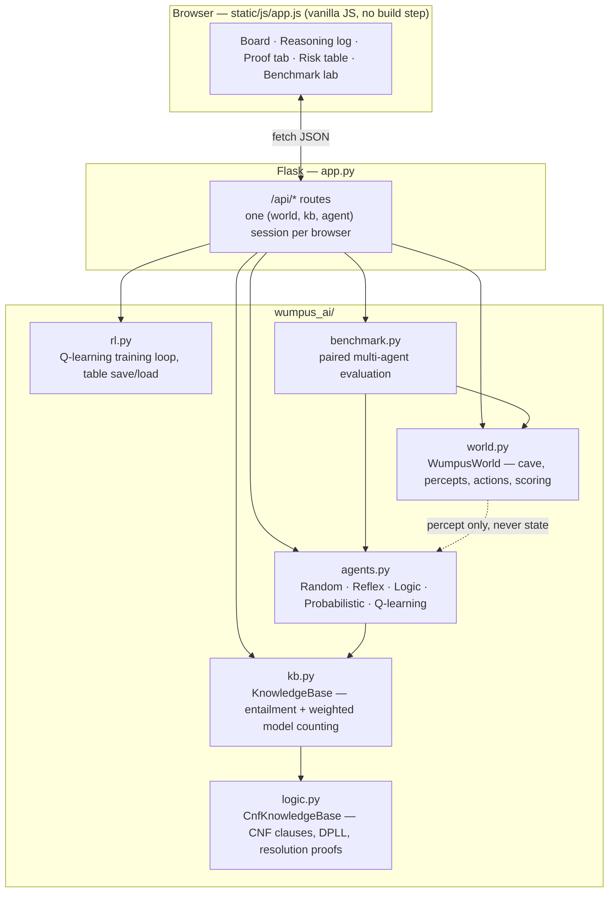

<div align="center">

# Wumpus World

**A knowledge-based agent that actually reasons — DPLL entailment, resolution proofs, Bayesian model counting, and tabular Q-learning, benchmarked against each other in a browser you can play.**

[](https://www.python.org/)
[](https://flask.palletsprojects.com/)
[](tests/test_wumpus.py)
[](LICENSE)
[](static/js/app.js)

[Live demo](#quickstart) · [How it works](#how-it-works) · [Results](#results) · [Screenshots](#screenshots) · [API](#api-reference)



</div>

---

## What this is

[Wumpus World](https://en.wikipedia.org/wiki/Wumpus_(video_game)) is the classic partially-observable, hostile-environment problem from Russell & Norvig's *Artificial Intelligence: A Modern Approach* (chapter 7). An agent is dropped into a dark cave holding one arrow. Somewhere in it: bottomless pits, a Wumpus, and gold. The agent can only sense the square it's standing on. Get it wrong and you die; get it right and you walk out rich.

Most implementations of this problem stop at "the agent reads the map." **This one doesn't let the agent see anything except a five-bit percept vector**, and it builds the actual inference machinery a textbook agent needs to survive on that alone:

- A **CNF knowledge base** with real propositional clauses, decided by **DPLL**, with **human-readable resolution proofs** you can inspect square by square in the browser.
- **Bayesian model counting** for when logic runs out of things to say — the same technique AIMA §13.7 describes, not a heuristic stand-in for it.
- A **tabular Q-learning agent** that gets none of the above — no rules, no percept semantics, just a state key and a reward signal — trained for 100,000 episodes, so you can watch reinforcement learning arrive at (most of) the same conclusions logic derives for free.
- A **paired benchmark harness** that runs all five agents over the *identical* sequence of caves, because "my agent seems good" isn't a result and a table is.

It ships as a small Flask app with a dependency-free vanilla-JS front end — no build step, no bundler, nothing to `npm install`.

---

## Table of contents

- [Screenshots](#screenshots)
- [Features](#features)
- [How it works](#how-it-works)
  - [1. Logical entailment — CNF, DPLL, resolution proofs](#1-logical-entailment-cnf-dpll-resolution-proofs)
  - [2. Probabilistic inference — weighted model counting](#2-probabilistic-inference-weighted-model-counting)
  - [3. Reinforcement learning — tabular Q-learning](#3-reinforcement-learning-tabular-q-learning)
  - [4. Turning belief into action](#4-turning-belief-into-action)
- [Architecture](#architecture)
- [The five agents](#the-five-agents)
- [Results](#results)
- [Quickstart](#quickstart)
- [Usage](#usage)
- [API reference](#api-reference)
- [Project structure](#project-structure)
- [Testing](#testing)
- [Engineering notes](#engineering-notes)
- [Assumptions & limitations](#assumptions-limitations)
- [Roadmap](#roadmap)
- [License](#license)

---

## Screenshots

<table>
<tr>
<td width="50%">

**Live reasoning, mid-game**
Risk-shaded board, percept memory, and a plain-English reasoning log tagged with the rule that produced each fact.



</td>
<td width="50%">

**A real resolution proof**
Click any square. This is DPLL refuting the negation of the claim — not a canned explanation.



</td>
</tr>
<tr>
<td width="50%">

**Benchmark lab**
Five agents, the same 200 caves, run from the browser.



</td>
<td width="50%">

**Q-learning, live**
Train a fresh table from zero and watch the curve climb.



</td>
</tr>
<tr>
<td width="50%">

**Risk table**
Every unexplored square, ranked by danger, click-through to its proof.



</td>
<td width="50%">

**Responsive**
Full board, no horizontal scroll, down to a 390px phone.



</td>
</tr>
</table>

<details>
<summary><b>Rules panel</b> (click to expand)</summary>
<br>

</details>

---

## Features

**Reasoning you can audit, not just trust**
- AI Vision overlay — every unexplored square shaded by inferred danger, with live `P(pit)` and `P(Wumpus)`.
- Reasoning log — each derived fact as it's derived, tagged `R1`–`R6`, `W0`–`W2`, `P1` for the rule that produced it.
- Proof tab — click any square for the DPLL verdict *and* the resolution chain that proves it.
- Percept memory — squares you've visited show what you smelled there, so you can re-derive the agent's logic by eye.

**Play it, watch it, or race it**
- Manual play with keyboard, mouse, or the on-screen D-pad.
- **Hint** — ask any agent what it would do here, without committing to the move.
- **Step** / **Auto Play** (speed-adjustable) / **Solve** (instant, replayed frame by frame).
- Five selectable agents (below), a difficulty picker, and reproducible seeds you can copy and share.

**Evidence, not vibes**
- In-browser **benchmark lab** — paired comparison across identical caves, chart + full stats table.
- In-browser **RL training** — train a Q-table from scratch and watch the learning curve plotted live.
- 26 automated tests, including a 300-cave soundness proof and a cross-check that two independent inference engines never disagree.

---

## How it works

No agent in this project can see the map. The environment (`wumpus_ai/world.py`) hands out a five-bit `Percept` — `stench`, `breeze`, `glitter`, `bump`, `scream` — and nothing else. `tests/test_wumpus.py::test_agents_cannot_see_the_map` enforces this directly: it swaps the gold and the Wumpus to different squares behind an agent's back, mid-decision, and asserts the decision doesn't change.

### 1. Logical entailment — CNF, DPLL, resolution proofs

Percepts are compiled into a CNF knowledge base (`wumpus_ai/logic.py`) over four symbol families per square: `P` (pit), `W` (Wumpus), `B` (breeze), `S` (stench). The physics of the cave is written as **biconditionals**, exactly the way the textbook states rule R2:

```
B(r,c)  ⟺  P(r-1,c) ∨ P(r+1,c) ∨ P(r,c-1) ∨ P(r,c+1)
S(r,c)  ⟺  W(r-1,c) ∨ W(r+1,c) ∨ W(r,c-1) ∨ W(r,c+1)
```

plus "there is at least one Wumpus," "there is at most one Wumpus" (one clause per pair of squares), and "the entrance is never a pit." Each actual percept is then asserted as a separate unit clause. That separation is deliberate: writing "no breeze here, therefore no pit next door" directly into the KB would make the conclusion a restatement, not a derivation. Keeping the rule and the observation apart means the Proof tab has something real to show.

Entailment is answered the standard way — `KB ⊨ α` iff `KB ∧ ¬α` is unsatisfiable — decided by a **from-scratch DPLL** solver with unit propagation and pure-literal elimination. When the query is UNSAT, a unit-resolution refutation is reconstructed and returned as a readable chain:

```
¬B30  and  B30 ∨ ¬P31    resolve on ¬B30   ⟹   ¬P31
 P31  and  ¬P31          resolve on  P31   ⟹   ⊥
```

The empty clause is the contradiction, so `¬P31` is entailed and `(3,1)` is safe. This is exactly what the Proof tab shows for every square, live.

Because there is **exactly one** Wumpus, the stench biconditional cuts both ways — it rules squares *in* and *out* simultaneously — so a handful of percepts routinely pins the Wumpus to a single square, turning the one arrow you're carrying from a gamble into a guaranteed kill.

One subtlety that cost a real bug during development: a stench recorded at time *t* only claims the Wumpus was adjacent *then*. Once it's shot, that clause becomes false, and an unsatisfiable KB entails *everything* — DPLL would happily "prove" every square on the board safe. `CnfKnowledgeBase.kill_wumpus()` retracts every clause that was only true while the Wumpus was alive; `test_killing_the_wumpus_keeps_the_kb_satisfiable` guards the regression.

### 2. Probabilistic inference — weighted model counting

Logic frequently has nothing to say — most unexplored squares are simply *possible*, not provable either way — and the agent still has to move. `wumpus_ai/kb.py` then computes `P(pit | every breeze so far)` by weighted model counting, following AIMA §13.7:

1. Take the **frontier** — unknown squares adjacent to somewhere already visited.
2. Enumerate every pit assignment on the frontier consistent with *every* breeze percept recorded.
3. Weight each consistent model by the pit prior and sum.
4. A square's marginal probability is its share of that total weight.

Naively this is `2^|frontier|`. It stays fast because the frontier is **split into independent components** first — two frontier squares can only interact if some visited square is adjacent to both — and each component is enumerated separately. Components above 20 variables fall back to weighted rejection sampling. Even a 10×10 cave stays comfortably inside the exact regime in practice.

**Worked example.** Stand on the entrance, no breeze. Step up: a breeze. That square has exactly two unknown neighbours, so at least one holds a pit. With prior `p = 3/15`:

```
P(pit at X | pit at X or Y) = p / (1 − (1 − p)²) = 0.2 / 0.36 ≈ 55.6%
```

Both squares light up at 56% in the app. The probabilistic agent's risk threshold is 34%, so it declines both and climbs out at −1 rather than taking what is, in expectation, a losing bet on −1000.

Two independent algorithms — DPLL and model counting — answer "is this square safe?" and they must never disagree. `test_prover_agrees_with_model_counting` checks this at every step of 120 full games.

### 3. Reinforcement learning — tabular Q-learning

`wumpus_ai/agents.py::QLearningAgent` gets told none of the above. It sees a compact state key and a scalar reward and has to work out for itself, purely from experience, that a breeze is bad news.

**State key** (5,184 possible states) — `breeze, stench, glitter, has_gold, at_start`, plus whether each of the four neighbours is a wall, unvisited, or already visited.

**Reward** is the environment's own score delta, so the agent optimises exactly what the other four agents are scored on.

**Training** (`wumpus_ai/rl.py`) — standard tabular Q-learning, `α = 0.15`, `γ = 0.95`, ε decayed from 1.0 to 0.05 over the first 60% of episodes and held there for the rest, so training ends by refining a policy rather than still exploring at random. Each episode gets a *fresh random cave*, which forces a general policy instead of a memorised map. The bundled `wumpus_ai/q_table.json` was trained for 100,000 episodes and covers 442 distinct states.

The arrow is deliberately left out of the action space — four extra shoot actions would nearly double it, and the arrow only matters in well under 10% of caves, which costs far more in sample efficiency than it wins back.

### 4. Turning belief into action

The logic and probabilistic agents share one decision procedure (`LogicAgent.decide`), in priority order:

1. Glitter here → **grab**.
2. Carrying gold → route home through the proven-safe set via BFS, then **climb**.
3. A proven-safe unexplored square exists → BFS to the nearest one.
4. Wumpus pinned to one square, arrow in hand, and killing it would open new ground → manoeuvre onto its row/column and **shoot**.
5. Nothing provably safe → take the lowest-danger frontier square, *but only* below the agent's `risk_tolerance`.
6. Otherwise → retreat and **climb** out with whatever score remains.

`LogicAgent` runs this with `risk_tolerance = 0`, so step 5 never fires — it only ever moves where safety is *entailed*. `ProbabilisticAgent` is the same class with `risk_tolerance = 0.34`. Same knowledge, different policy — the [results](#results) below show exactly what that trade costs and buys.

---

## Architecture



The environment and the agents are genuinely separate objects. `WumpusWorld` never exposes `pits`, `wumpus`, or `gold` to anything downstream of a percept — the only channel out is `KnowledgeBase.tell()`. That boundary is what makes the "knowledge-based" claim literal rather than decorative, and it's covered by a dedicated test (`test_agents_cannot_see_the_map`).

---

## The five agents

| Agent | Architecture | Behaviour |
|---|---|---|
| **Random Walker** | None | Control group. Moves at random, grabs gold if it trips over it. |
| **Reflex Agent** | Percept → rule, no plan | One-step safety rule only ("no breeze/stench here ⟹ neighbours are safe"). No memory of *why*, so it frequently walks itself into a corner. |
| **Logic Agent** | Knowledge-based, `risk_tolerance = 0` | Moves only where the CNF knowledge base *proves* safety. |
| **Probabilistic Agent** | Knowledge-based, `risk_tolerance = 0.34` | Same knowledge base, plus weighted model counting to price risk once logic is silent. |
| **Q-Learning Agent** | Tabular RL, 100k episodes trained | No rules at all — a state key, a reward, and 100,000 episodes of trial and error. |

---

## Results

200 caves, 4×4 board, 3 pits, every agent facing the **identical seed sequence** (a paired comparison — any difference is the agent, not luck):

| Agent | Win % | Death % | Stuck % | Avg score | Avg moves |
|---|---:|---:|---:|---:|---:|
| **Probabilistic** | 42.5 | 7.0 | 0.0 | **+346.8** | 7.3 |
| **Logic** | 31.5 | **0.0** | 0.0 | +308.6 | 5.8 |
| Q-Learning | 16.0 | 0.0 | 13.0 | +130.7 | 29.3 |
| Reflex | 32.0 | 23.5 | 44.5 | −13.2 | 98.2 |
| Random | 4.0 | 96.0 | 0.0 | −925.2 | 5.2 |

The same five agents on 100 caves of 8×8 with 10 pits:

| Agent | Win % | Death % | Stuck % | Avg score |
|---|---:|---:|---:|---:|
| **Logic** | 27.0 | **0.0** | 0.0 | **+253.2** |
| Probabilistic | 39.0 | 25.0 | 0.0 | +113.4 |
| Q-Learning | 9.0 | 0.0 | 43.0 | +1.4 |
| Reflex | 18.0 | 15.0 | 67.0 | −116.5 |
| Random | 3.0 | 97.0 | 0.0 | −949.1 |

*(Reproduce these yourself with the [Benchmark](#screenshots) button, or `python -c "from wumpus_ai.benchmark import benchmark; print(benchmark(['random','reflex','logic','probabilistic','qlearning'], episodes=200))"`.)*

**What these numbers actually show:**

- **Sound inference cannot kill you.** `LogicAgent` has zero risk tolerance, so it only ever steps where safety is entailed. It died 0 times across 1,000 test games (`test_logic_agent_never_dies`). Every point it loses is opportunity cost — a cave it walks away from because the gold was never provably reachable, never a death.

- **Risk tolerance is a trade, and the trade inverts with board size.** On 4×4 the probabilistic agent wins 11 points more often *and* scores higher on average — a clean win. On 8×8 it still wins far more often (39% vs. 27%) but its *average score is less than half* the logic agent's, because more decisions means more gambles compounding into a 25% death rate. **More wins, worse expected outcome** — the single most interesting result in this project, and it only shows up because the benchmark is paired and run at more than one board size.

- **Reinforcement learning learns safety but not efficiency.** After 100,000 episodes the Q-learning agent never dies — genuinely nontrivial from reward alone, with zero domain knowledge encoded. But it still scores under half of what the logic agent scores with *zero* training, because its state key can say "there's a breeze" but never *which* neighbour caused it — so the best it can do is back away and try another direction. It gets stuck 13% of the time on 4×4 and collapses on 8×8 (a board size it wasn't trained on).

- **Reflex agents livelock.** Stuck 44.5% of the time on 4×4, 67% on 8×8 — bouncing between two visited squares forever, with no plan and no goal stack to break the cycle. 98 average moves against the logic agent's 6. This is the textbook's own argument for moving past reflex agents, reproduced as a number instead of asserted as a claim (`test_reflex_agent_livelocks`).

---

## Quickstart

Requires Python 3.9+ and no external services.

```bash
git clone https://github.com/nayana3333/Wumpus-world-ai.git
cd Wumpus-world-ai
pip install -r requirements.txt
python app.py
```

Open **http://127.0.0.1:5000**.

On Windows, `run.bat` does all of the above in one double-click (creates a virtual environment, installs dependencies, starts the server).

<details>
<summary>Retrain the Q-learning agent</summary>

```bash
python -m wumpus_ai.rl 100000
```

Overwrites `wumpus_ai/q_table.json`. Takes about two minutes on a typical laptop. You can also train a smaller table straight from the browser with the **Train RL** button — see the [screenshots](#screenshots).
</details>

---

## Usage

| Key | Action |
|---|---|
| `↑ ↓ ← →` / `W A S D` | Move |
| `Shift` + direction | Shoot the arrow |
| `G` | Grab |
| `C` | Climb |
| `Space` | One AI step |
| `Enter` | Toggle Auto Play |
| `H` | Hint (advice only, doesn't act) |
| `N` | New cave |
| `Esc` | Close any open modal |

**Difficulty presets:** Easy (4×4, 2 pits) · Classic (4×4, 3 pits — the textbook setup) · 6×6 (6 pits) · 8×8 (12 pits). Board size and pit count are also freely adjustable, 3×3 up to 12×12.

**Seeds** make every cave reproducible — copy one to replay it, or hand it to someone else to compare agents on the exact same board.

---

## API reference

Every response carries both `state` (what's observable — what a human sees) and `knowledge` (what the KB has derived from it), so the browser never has to infer anything itself.

| Method | Endpoint | Purpose |
|---|---|---|
| `GET` | `/api/meta` | Agent catalogue, difficulty presets, scoring constants |
| `POST` | `/api/new` | Start a cave — `{size, pits, seed, agent}` |
| `GET` | `/api/state` | Current state + knowledge |
| `POST` | `/api/action` | Human action — `{action, direction}` |
| `POST` | `/api/hint` | An agent's recommendation, not executed |
| `POST` | `/api/ai/step` | The selected agent takes one action |
| `POST` | `/api/ai/solve` | Plays the cave to completion, returns every frame for replay |
| `POST` | `/api/proof` | DPLL verdict + resolution proof for one square — `{r, c}` |
| `POST` | `/api/reveal` | Reveal the map without ending the episode |
| `POST` | `/api/benchmark` | Batch comparison — `{agents, episodes, size, pits}` |
| `POST` | `/api/rl/train` | Train a fresh Q-table, returns the learning curve |

Long-running endpoints (`/api/benchmark`, `/api/rl/train`) enforce a wall-clock budget and trim the requested episode count to fit — see [Engineering notes](#engineering-notes).

---

## Project structure

```
wumpus-world-ai/
├── app.py                    # Flask routes — thin; owns session storage & locking only
├── requirements.txt
├── run.bat                   # one-click Windows launcher
├── LICENSE
│
├── wumpus_ai/                 # everything that isn't presentation
│   ├── world.py               # WumpusWorld: cave generation, percepts, actions, scoring
│   ├── logic.py                # CnfKnowledgeBase: CNF clauses, DPLL, resolution proofs
│   ├── kb.py                  # KnowledgeBase: entailment + weighted model counting
│   ├── agents.py               # RandomAgent, ReflexAgent, LogicAgent,
│   │                           #   ProbabilisticAgent, QLearningAgent
│   ├── rl.py                  # Q-learning training loop, table save/load
│   ├── benchmark.py            # paired multi-agent evaluation harness
│   └── q_table.json            # bundled agent — 100,000 episodes, 442 states
│
├── templates/index.html
├── static/
│   ├── css/style.css
│   └── js/app.js               # the entire front end — no framework, no build step
│
├── tests/test_wumpus.py        # 26 tests
└── docs/                       # README assets (screenshots, demo.gif)
```

---

## Testing

```bash
python -m unittest discover -s tests -v
```

26 tests, ~1 minute. The three that carry the most weight:

- **`test_kb_is_sound`** — plays 300 full games and, at *every single step*, cross-checks every square the knowledge base currently calls "safe" against the hidden ground truth. Zero violations, checked, not assumed. This is the closest thing in the repo to a correctness proof rather than a plausibility argument.
- **`test_prover_agrees_with_model_counting`** — two independent inference engines (DPLL resolution and weighted model counting) must reach the same safety verdict for every square, at every step, across 120 games. A disagreement here means one of the two algorithms is wrong.
- **`test_agents_cannot_see_the_map`** — moves the gold and the Wumpus behind an agent's back mid-decision and asserts nothing changes. The one test that makes "knowledge-based agent" a verified claim instead of a docstring.

---

## Engineering notes

A few decisions that came out of an actual review pass on this codebase, not just the happy path:

- **Session isolation under concurrency.** The dev server is threaded; two requests against the same session used to be able to race. All session-mutating routes now hold a single lock, verified with 6 threads × 75 concurrent requests and zero failures.
- **Bounded eviction, not a full flush.** The session store used to `clear()` itself entirely once it hit capacity — one new player would silently wipe every other in-progress game. It's an `OrderedDict` now: LRU + TTL eviction, so filling up only evicts the oldest session.
- **Wall-clock budgets on batch endpoints.** `/api/benchmark` and `/api/rl/train` both run inside a single HTTP request. Uncapped, a large request could take **192 seconds** on one call — long past any sane timeout. Both now scale their episode count to a measured time budget and tell the caller when they trimmed the request, rather than silently returning a smaller experiment than the one asked for.
- **No query-mutates-state bugs.** `CnfKnowledgeBase.proof()` used to write its scratch "assume the opposite" clause into the KB's permanent clause store — a read-only query silently polluting shared state. It's fully sandboxed now, verified with a before/after clause-count check.
- **The debugger is opt-in.** Flask's interactive debugger is off by default (`FLASK_DEBUG=1` to enable) — leaving it on by default in a repo strangers clone and run is a remote-code-execution footgun, not a convenience.
- **No dead code.** A cleanup pass removed several methods and fields that were written to but never read (`safe_cells()`, `danger_of()`, `note_gold_taken()`, an agent `self.plan` that looked stateful but was recomputed from scratch every call) — the kind of thing that reads as intentional architecture until you check whether anything actually calls it.

---

## Assumptions & limitations

- **Independent pit priors.** Model counting weights each pit placement by an independent prior per square, following AIMA. The generator actually places a *fixed count* of pits, which correlates squares slightly. This is the standard simplification, and the error is small at these board sizes — but it is an assumption, not a fact, and worth naming if you're citing the probabilities anywhere serious.
- **Independent-hazard approximation.** Danger is combined as `1 − (1 − P(pit))(1 − P(wumpus))`. The two hazards are placed independently at generation time, so this is reasonable — but both are conditioned on the same percept history, so it's an approximation, not an exact joint.
- **The prover is capped at 8×8.** "At most one Wumpus" is `O(n⁴)` clauses in the board side; DPLL on a 12×12 board is slow enough to be worth avoiding. Above the cap, the knowledge base falls back to model counting only, and the Proof tab says so explicitly rather than pretending.
- **The bundled Q-table was trained on 4×4.** It runs on any board size, but its numbers on larger boards reflect a policy that never saw that state distribution during training — which is itself part of the point being made in the [results](#results).

---

## Roadmap

- [ ] Deep Q-learning with function approximation, to see whether it generalises across board sizes where the tabular agent can't.
- [ ] A moving-Wumpus variant — turns the stench biconditional into a temporal one and breaks the "visited squares are permanently safe" assumption.
- [ ] CSV/JSON export from the benchmark lab for offline analysis.
- [ ] Multi-Wumpus support (relaxes the "exactly one" axiom that currently drives most of the logical pruning).

---

## License

[MIT](LICENSE) — use it, fork it, put it in a report, whatever's useful.

Built against Russell & Norvig, *Artificial Intelligence: A Modern Approach*, chapter 7 (Wumpus World) and chapter 13 (probabilistic reasoning).

<div align="center">

If this was useful, a ⭐ on the repo is appreciated.

</div>
